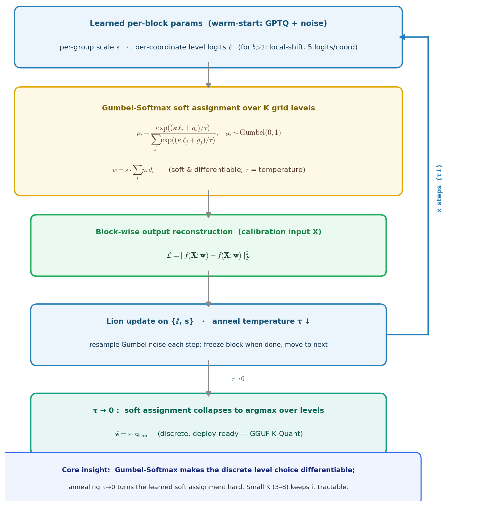

# 复现报告: GSQ-2604.18556

- **论文:** [GSQ: Highly-Accurate Low-Precision Scalar Quantization for LLMs via Gumbel-Softmax Sampling](https://arxiv.org/abs/2604.18556) (arXiv:2604.18556)
- **仓库:** https://github.com/IST-DASLab/GSQ@194281e25c93c6eb916784db049c536c6996451f
- **环境:** CUDA 13.0 / torch 2.11.0+cu130 / transformers 5.8.1

| model | config | algorithm | metric | paper | 实测 | 判定 | 原因 |
|---|---|---|---|---|---|---|---|
| meta-llama/Llama-3.1-8B-Instruct | BF16 | - | acc_norm_avg | 73.71 | 73.79(+0.08) | MATCH | — |
| meta-llama/Llama-3.1-8B-Instruct | INT2 G128 | GSQ | acc_norm_avg | 68.55 | 66.51(-2.04) | PARTIAL | 过程忠实但数值超容差 2.04 (>0.5) |

## 结论
- 共 2 个 claim:MATCH 1 · PARTIAL 1 · FAIL 0 · BLOCKED 0。
- FP 基线与论文吻合,说明**评测协议可信**;因此 1 个超容差的量化配置(最大偏差 -2.04)是**真实的复现差距**(算法/校准/版本所致),而非评测口径问题。

## 算法概览



GSQ 是一种后训练标量量化方法，核心是把**离散**的量化档位分配变成可微的。它为每个坐标学习分配 logits `ℓ`（以及 per-group 缩放 `s`），并不硬选某个档位，而是用 **Gumbel-Softmax** 在 K 个候选档位上做软加权求和：`p_i = softmax((κℓ_i + g_i)/τ)`，`w̃ = s·Σ p_i d_i`。这些参数按 block 优化（Lion 优化器 + 校准数据），最小化输出重建误差 `‖f(X;w) − f(X;w̃)‖²_F`。退火温度 `τ → 0` 使软分配坍缩到单一硬档位，得到 `ŵ = s·q_hard`——一个完全离散、可直接部署的层（兼容 GGUF K-Quant）。把松弛的档位数 K 保持很小（三值/低 bpp 时 K = 3–8）正是让这个离散优化可行的关键。

## 各任务原始分数
**llama3-8b-baseline**

|    Tasks    |Version|Filter|n-shot| Metric |   |Value |   |Stderr|
|-------------|------:|------|-----:|--------|---|-----:|---|-----:|
|arc_challenge|      1|none  |     0|acc     |↑  |0.5179|±  |0.0146|
|             |       |none  |     0|acc_norm|↑  |0.5512|±  |0.0145|
|arc_easy     |      1|none  |     0|acc     |↑  |0.8178|±  |0.0079|
|             |       |none  |     0|acc_norm|↑  |0.7980|±  |0.0082|
|hellaswag    |      1|none  |     0|acc     |↑  |0.5910|±  |0.0049|
|             |       |none  |     0|acc_norm|↑  |0.7924|±  |0.0040|
|piqa         |      1|none  |     0|acc     |↑  |0.8003|±  |0.0093|
|             |       |none  |     0|acc_norm|↑  |0.8085|±  |0.0092|
|winogrande   |      1|none  |     0|acc     |↑  |0.7395|±  |0.0123|

**llama3-8b-2bit-avg-acc**

|    Tasks    |Version|Filter|n-shot| Metric |   |Value |   |Stderr|
|-------------|------:|------|-----:|--------|---|-----:|---|-----:|
|arc_challenge|      1|none  |     0|acc     |↑  |0.4241|±  |0.0144|
|             |       |none  |     0|acc_norm|↑  |0.4590|±  |0.0146|
|arc_easy     |      1|none  |     0|acc     |↑  |0.7593|±  |0.0088|
|             |       |none  |     0|acc_norm|↑  |0.7285|±  |0.0091|
|hellaswag    |      1|none  |     0|acc     |↑  |0.5077|±  |0.0050|
|             |       |none  |     0|acc_norm|↑  |0.6884|±  |0.0046|
|piqa         |      1|none  |     0|acc     |↑  |0.7584|±  |0.0100|
|             |       |none  |     0|acc_norm|↑  |0.7573|±  |0.0100|
|winogrande   |      1|none  |     0|acc     |↑  |0.6922|±  |0.0130|


## 复算脚本(每个 config)
**meta-llama/Llama-3.1-8B-Instruct · BF16**
`runs/GSQ-2604.18556-20260621-091834/claims/llama3-8b-baseline/stdout.log`

```bash
export SLURM_JOB_ID=local
VLLM_USE_DEEP_GEMM=0 VLLM_MOE_USE_DEEP_GEMM=0 EVAL=1 KEEP_SERVING=0 \
  MODEL_PATH=$PAPER_REPRISE_MODEL \
  EVAL_TASKS=${PAPER_REPRISE_TASKS:-arc_challenge,arc_easy,hellaswag,winogrande,piqa} \
  TP_SIZE=${PAPER_REPRISE_GPUS:-8} \
  bash scripts/serve_model.sh
```

**meta-llama/Llama-3.1-8B-Instruct · INT2 G128 · GSQ**
`runs/GSQ-2604.18556-20260621-091834/claims/llama3-8b-2bit-avg-acc/stdout.log`

```bash
bash scripts/serve_model.sh && python eval_model.py --config configs/local/config.yaml
  --base-url http://localhost:8000/v1/completions
  --tasks arc_challenge,arc_easy,hellaswag,winogrande,piqa
```
