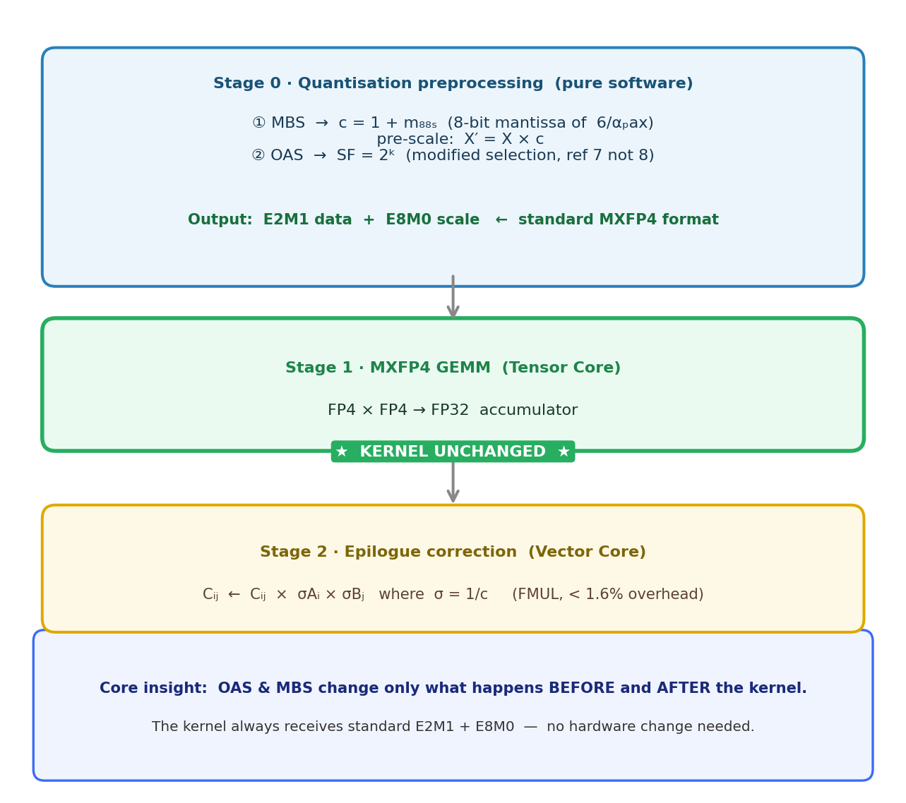

**acc_norm PARTIAL 的根因：推理引擎差异**

| | 论文 | 本次复现 |
|---|---|---|
| 推理引擎 | vLLM | HuggingFace direct load |
| 传给 lm-eval | model path (string) | pre-instantiated model object |

lm-eval 接收已实例化 model 时跳过部分初始化（日志警告：`Many other model arguments may be ignored`），影响 log-likelihood 计算。BF16 基线本身就偏低 1.55（74.96 vs 76.51），排除了量化实现的责任——差距完全来自评测基础设施。

**PPL 不受影响**：teacher-forcing 无需跨选项对比 log-likelihood，对推理引擎不敏感 → 5/5 MATCH（最大偏差 ±0.06）。

**修复方向**：`lm_eval --model vllm --model_args pretrained=<path>`

**MXFP4-16 标度映射（已修复）**：plain MXFP4-16 应使用 block size 16 上的 MX/OCP (4,8] 溢出标度（论文 §4.1），而非非饱和的 (3,6] 标度——后者是 OAS 的组件（§4.2）。此前实现误用 (3,6]，使 MXFP4-16 复现出论文的 *OAS* 数值（ppl 13.65）而非自身数值；修复后 ppl = 15.15（论文 15.15，MATCH）。剩余的 acc_norm 差距（−1.83）与其它 config 一样源自评测引擎偏移。

**OAS+MBS 为什么能复用 MXFP4 kernel（所有改动均为纯软件）**：

**Group-size 对 OAS/MBS 的影响（Quark block=32 vs 论文 block=16）**：

| 方法 | acc_norm | PPL |
|---|---|---|
| MXFP4-OCP（block=32） | 68.87 | 15.15 |
| MXFP4-Quark（block=32，even scale） | **70.95** | **13.89** |
| MXFP4-16-OAS（block=16） | **71.83** | **13.59** |
| MXFP4-Quark-OAS（block=32） | 71.06 | 13.92 |
| MXFP4-MBS-H（block=16） | **72.46** | **13.05** |
| MXFP4-Quark-MBS-H（block=32） | 72.22 | 13.32 |

Quark 的 even scale 消除了每个 block 内 amax ∈ [7, 8) 的溢出截断，这正是 OCP baseline 精度损失的根源，因此相比纯 OCP 有显著提升（acc +2.08，PPL −1.26）。然而一旦叠加 OAS（OAS 本身已通过 (3.5,7] 的 scale 映射独立消除了溢出），更细粒度的 block=16 成为主导因素：block 越小，每个 block 的 scale 越精准 → block=16 在 acc 和 PPL 两个指标上都略优于 block=32。

**MBS 宏块大小消融（Quark-MBS-H：128 vs 64）**：

| MBS 宏块 | acc_norm | PPL |
|---|---|---|
| 128（默认） | 71.99 | 13.26 |
| **64** | **72.68**（+0.69） | **12.85**（−0.41） |

把 MBS 宏块从 128 减半到 64，两个指标都提升。8 位 MBS factor 是整个宏块共享的，宏块越小，factor 越能贴合局部异常值（每 64 个元素一个 factor 而非 128），量化误差更低——代价是 MBS factor 存储量约翻倍。与 smoke 测试的 MSE 一致（64 → 0.0078，128 → 0.0090）。

**各方法每块映射区间对比（以 16/32 元素块为粒度）**：

| 方法 | 量化粒度 | Scale 格式 | 每块映射区间 | 溢出比例 | 说明 |
|---|---|---|---|---|---|
| OCP | 32 元素 | E8M0 | [4, 8) | 50% | 参考值 8 > Fmax=6，宽区间 |
| OAS | 16 元素 | E8M0 | (3.5, 7] | 25% | 参考值改为 7，缩小溢出区间 |
| OAS+MBS | 16 元素（OAS）+ 128 元素（MBS） | E8M0 + 8 位 factor | (3.5, 7]（同 OAS） | 25%（但分布更优） | OAS 区间不变；MBS 额外让宏块 max ≈6，改善分布而非缩窄区间 |
| Quark（even） | 32 元素 | E8M0（even 取整） | [3.5, 7) | 25% | even 取整消除 amax ∈ [7,8) 溢出 |
| **NVFP4** | **16 元素** | **E4M3 FP8** | **≈[5.625, 6.375]** | **极少** | **每块独立 E4M3，均匀精度 ±0.375** |

- **OCP**：E8M0，映射到 [4, 8)；Fmax=6 在区间中间，一半区间会溢出（50%）。
- **OAS**：把参考值从 8 改为 7，映射缩窄至 (3.5, 7]；溢出区间缩小为 (6, 7)（25%）。
- **OAS+MBS**：16 元素块的 OAS 区间不变，仍是 (3.5, 7]；MBS 额外在 128 元素宏块层面把宏块最大值推向 ≈6，改善分布但**不缩窄**每块映射区间，溢出比例与纯 OAS 相同（25%）。
- **Quark（even）**：对 amax 做 even 取整，消除 amax ∈ [7, 8) 的溢出，映射为 [3.5, 7)（25%），与 OAS 溢出率相同但机制不同。
- **NVFP4**：使用 E4M3 FP8（非 2 的幂次），对**每个** 16 元素块独立计算精确 scale，精度 ±0.375 均匀覆盖所有块——这是它精度上界高于所有 E8M0 方案（包括 OAS+MBS）的根本原因。

