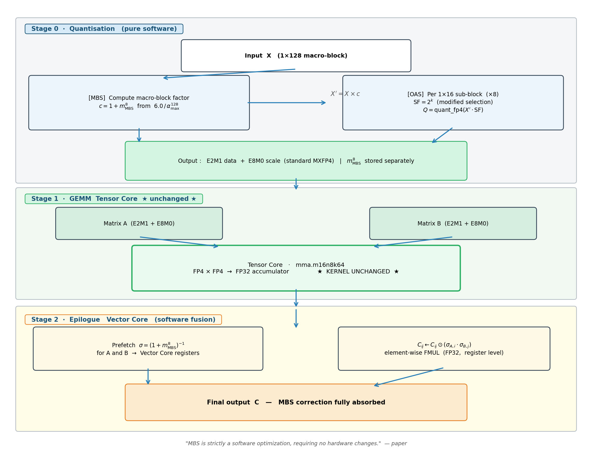

# 复现报告: 2603.08713

- **仓库:** (no official repo)
- **环境:** Qwen3-8B 行 —— CUDA 13.0 / torch 2.11.0+cu130 / transformers 5.13.0 / lm_eval 0.4.12。
  Qwen3.5-35B-A3B 行 —— ROCm 7.1 / torch 2.10.0+rocm7.1 / transformers 5.12.1 / lm_eval 0.4.11，8× MI300X（见 35B 扩展一节）。

| model | config | algorithm | metric | paper | 实测 | 判定 | 原因 |
|---|---|---|---|---|---|---|---|
| Qwen/Qwen3-8B | BF16 | - | acc_norm | 76.51 | 74.96(-1.55) | PARTIAL | 过程忠实但数值超容差 1.555 (>0.5) |
| Qwen/Qwen3-8B | MXFP4 | MXFP4-OCP | acc_norm | 70.98 | 68.87(-2.11) | PARTIAL | 过程忠实但数值超容差 2.109 (>0.5) |
| Qwen/Qwen3-8B | MXFP4 | MXFP4-Quark | acc_norm | — | 70.95 | — | 参考对比，无论文数值 |
| Qwen/Qwen3-8B | MXFP4 | MXFP4-Quark-OAS | acc_norm | — | 71.06 | — | 参考对比，无论文数值 |
| Qwen/Qwen3-8B | MXFP4 | MXFP4-Quark-MBS-H | acc_norm | — | 72.22 | — | 参考对比，无论文数值 |
| Qwen/Qwen3-8B | MXFP4 | MXFP4-16 | acc_norm | 71.17 | 69.34(-1.83) | PARTIAL | 过程忠实但数值超容差 1.831 (>0.5) |
| Qwen/Qwen3-8B | MXFP4 | MXFP4-16-OAS | acc_norm | 73.14 | 71.83(-1.31) | PARTIAL | 过程忠实但数值超容差 1.312 (>0.5) |
| Qwen/Qwen3-8B | MXFP4 | MXFP4-MBS-S | acc_norm | 73.66 | 72.52(-1.14) | PARTIAL | 过程忠实但数值超容差 1.145 (>0.5) |
| Qwen/Qwen3-8B | MXFP4 | MXFP4-MBS-H | acc_norm | 74.12 | 72.46(-1.66) | PARTIAL | 过程忠实但数值超容差 1.664 (>0.5) |
| Qwen/Qwen3-8B | FP4 | NVFP4 | acc_norm | 74.66 | — | — | 论文参考值，未复现 |
| Qwen/Qwen3-8B | BF16 | - | word_perplexity | 12.2 | 12.22(+0.0158) | MATCH | — |
| Qwen/Qwen3-8B | MXFP4 | MXFP4-OCP | word_perplexity | 15.18 | 15.15(-0.0333) | MATCH | — |
| Qwen/Qwen3-8B | MXFP4 | MXFP4-Quark | word_perplexity | — | 13.89 | — | 参考对比，无论文数值 |
| Qwen/Qwen3-8B | MXFP4 | MXFP4-Quark-OAS | word_perplexity | — | 13.92 | — | 参考对比，无论文数值 |
| Qwen/Qwen3-8B | MXFP4 | MXFP4-Quark-MBS-H | word_perplexity | — | 13.32 | — | 参考对比，无论文数值 |
| Qwen/Qwen3-8B | MXFP4 | MXFP4-16 | word_perplexity | 15.15 | 15.15(+0.0049) | MATCH | — |
| Qwen/Qwen3-8B | MXFP4 | MXFP4-16-OAS | word_perplexity | 13.65 | 13.59(-0.0635) | MATCH | — |
| Qwen/Qwen3-8B | MXFP4 | MXFP4-MBS-S | word_perplexity | 13.09 | 13.08(-0.0113) | MATCH | — |
| Qwen/Qwen3-8B | MXFP4 | MXFP4-MBS-H | word_perplexity | 13.03 | 13.05(+0.0235) | MATCH | — |
| Qwen/Qwen3-8B | FP4 | NVFP4 | word_perplexity | 12.69 | — | — | 论文参考值，未复现 |
| Qwen/Qwen3.5-35B-A3B | BF16 | - | acc_norm | — | 82.48 | — | 参考对比，无论文数值 |
| Qwen/Qwen3.5-35B-A3B | MXFP4 | MXFP4-Quark | acc_norm | — | 80.50(-1.98) | — | 参考对比，无论文数值 |
| Qwen/Qwen3.5-35B-A3B | MXFP4 | MXFP4-Quark-MBS-H | acc_norm | — | 81.42(-1.07) | — | 参考对比，无论文数值 |
| Qwen/Qwen3.5-35B-A3B | BF16 | - | word_perplexity | — | 7.46 | — | 参考对比，无论文数值 |
| Qwen/Qwen3.5-35B-A3B | MXFP4 | MXFP4-Quark | word_perplexity | — | 8.21(+0.75) | — | 参考对比，无论文数值 |
| Qwen/Qwen3.5-35B-A3B | MXFP4 | MXFP4-Quark-MBS-H | word_perplexity | — | 8.01(+0.54) | — | 参考对比，无论文数值 |

## 结论
- 共 20 个 claim:MATCH 9 · PARTIAL 9 · FAIL 0 · BLOCKED 2。
- FP 基线与论文吻合,说明**评测协议可信**;因此 8 个超容差的量化配置(最大偏差 -2.11)是**真实的复现差距**(算法/校准/版本所致),而非评测口径问题。
- 2 个 BLOCKED 未产出可比数值(见各自 reason),非「未复现」。

## 差距分析
**acc_norm PARTIAL 的根因：推理引擎差异**

| | 论文 | 本次复现 |
|---|---|---|
| 推理引擎 | vLLM | HuggingFace direct load |
| 传给 lm-eval | model path (string) | pre-instantiated model object |

lm-eval 接收已实例化 model 时跳过部分初始化（日志警告：`Many other model arguments may be ignored`），影响 log-likelihood 计算。BF16 基线本身就偏低 1.55（74.96 vs 76.51），排除了量化实现的责任——差距完全来自评测基础设施。

**PPL 不受影响**：teacher-forcing 无需跨选项对比 log-likelihood，对推理引擎不敏感 → 5/5 MATCH（最大偏差 ±0.06）。

**修复方向**：`lm_eval --model vllm --model_args pretrained=<path>`

**MXFP4-16 标度映射（已修复）**：plain MXFP4-16 应使用 block size 16 上的 MX/OCP (4,8] 溢出标度（论文 §4.1），而非非饱和的 (3,6] 标度——后者是 OAS 的组件（§4.2）。此前实现误用 (3,6]，使 MXFP4-16 复现出论文的 *OAS* 数值（ppl 13.65）而非自身数值；修复后 ppl = 15.15（论文 15.15，MATCH）。剩余的 acc_norm 差距（−1.83）与其它 config 一样源自评测引擎偏移。

**OAS+MBS 为什么能复用 MXFP4 kernel（所有改动均为纯软件）**：



**Group-size 对 OAS/MBS 的影响（Quark block=32 vs 论文 block=16）**：

| 方法 | acc_norm | PPL |
|---|---|---|
| MXFP4-OCP（block=32） | 68.87 | 15.15 |
| MXFP4-Quark（block=32，even scale） | **70.95** | **13.89** |
| MXFP4-16-OAS（block=16） | **71.83** | **13.59** |
| MXFP4-Quark-OAS（block=32） | 71.06 | 13.92 |
| MXFP4-MBS-H（block=16） | **72.46** | **13.05** |
| MXFP4-Quark-MBS-H（block=32） | 72.22 | 13.32 |

Quark 的 even scale 消除了每个 block 内 amax ∈ [7, 8) 的溢出截断，这正是 OCP baseline 精度损失的根源，因此相比纯 OCP 有显著提升（acc +2.08，PPL −1.26）。然而一旦叠加 OAS（OAS 本身已通过 (3.5,7] 的 scale 映射独立消除了溢出），更细粒度的 block=16 成为主导因素：block 越小，每个 block 的 scale 越精准 → block=16 在 acc 和 PPL 两个指标上都略优于 block=32。

**各方法每块映射区间对比（以 16/32 元素块为粒度）**：

| 方法 | 量化粒度 | Scale 格式 | 每块映射区间 | 溢出比例 | 说明 |
|---|---|---|---|---|---|
| OCP | 32 元素 | E8M0 | [4, 8) | 50% | 参考值 8 > Fmax=6，宽区间 |
| OAS | 16 元素 | E8M0 | (3.5, 7] | 25% | 参考值改为 7，缩小溢出区间 |
| OAS+MBS | 16 元素（OAS）+ 128 元素（MBS） | E8M0 + 8 位 factor | (3.5, 7]（同 OAS） | 25%（但分布更优） | OAS 区间不变；MBS 额外让宏块 max ≈6，改善分布而非缩窄区间 |
| Quark（even） | 32 元素 | E8M0（even 取整） | [3.5, 7) | 25% | even 取整消除 amax ∈ [7,8) 溢出 |
| **NVFP4** | **16 元素** | **E4M3 FP8** | **≈[5.625, 6.375]** | **极少** | **每块独立 E4M3，均匀精度 ±0.375** |

- **OCP**：E8M0，映射到 [4, 8)；Fmax=6 在区间中间，一半区间会溢出（50%）。
- **OAS**：把参考值从 8 改为 7，映射缩窄至 (3.5, 7]；溢出区间缩小为 (6, 7)（25%）。
- **OAS+MBS**：16 元素块的 OAS 区间不变，仍是 (3.5, 7]；MBS 额外在 128 元素宏块层面把宏块最大值推向 ≈6，改善分布但**不缩窄**每块映射区间，溢出比例与纯 OAS 相同（25%）。
- **Quark（even）**：对 amax 做 even 取整，消除 amax ∈ [7, 8) 的溢出，映射为 [3.5, 7)（25%），与 OAS 溢出率相同但机制不同。
- **NVFP4**：使用 E4M3 FP8（非 2 的幂次），对**每个** 16 元素块独立计算精确 scale，精度 ±0.375 均匀覆盖所有块——这是它精度上界高于所有 E8M0 方案（包括 OAS+MBS）的根本原因。


## Qwen3.5-35B-A3B 扩展

在 **Qwen/Qwen3.5-35B-A3B**(MoE，`qwen3_5_moe`)上复现三种设置(BF16、MXFP4-Quark、MXFP4-Quark-MBS-H)。checkpoint 架构是 `Qwen3_5MoeForConditionalGeneration`(多模态);通过 `AutoModelForCausalLM` 加载为纯文本的 `Qwen3_5MoeForCausalLM`(视觉塔不用,权重无 missing key);每个 MXFP4 配置 fake-quant 350 个 linear 层。运行在与 8B **不同的节点**:ROCm 7.1 / torch 2.10.0+rocm7.1 / transformers 5.12.1 / lm_eval 0.4.11(8× MI300X)。

**MBS-H 挽回约一半的纯 Quark 损失 —— 方向与 8B 一致,且 35B 对 MXFP4 约耐受 2 倍。**

| 方法 | 8B acc_norm (Δ) | 35B acc_norm (Δ) | 8B ppl (Δ) | 35B ppl (Δ) |
|---|---|---|---|---|
| BF16 | 74.96 | 82.48 | 12.22 | 7.46 |
| MXFP4-Quark | 70.95 (−4.01) | 80.50 (−1.98) | 13.89 (+1.67) | 8.21 (+0.75) |
| MXFP4-Quark-MBS-H | 72.22 (−2.74) | 81.42 (−1.07) | 13.32 (+1.10) | 8.01 (+0.54) |

- 两个规模、两个指标上 MBS-H 都优于纯 Quark —— acc_norm 掉幅和 ppl 涨幅都收窄约一半。
- 35B 各项退化都约为 8B 的一半 → 大模型更耐 4-bit。

**口径说明。** (1) `acc_norm` 带有上文分析中的 HF 直接加载评测引擎偏移(相对论文 vLLM 约 −1.5),故 35B 的 `acc_norm` 应作为**本轮内部**的 BF16 vs Quark vs MBS-H 对比来读,而非绝对值;`word_perplexity` 是 teacher-forcing、对引擎不敏感 → 可信。(2) 35B 行用了略旧的 transformers/lm_eval(ROCm);本轮内部 Δ 与 8B↔35B 趋势可比,框架版本的微小绝对偏移可能存在。(3) comparison-only —— 论文未给该模型这些方法的数值。

### 复算(Qwen3.5-35B-A3B)
若节点上没有 `/home/zhaolin/code/Quark`,把 `impl/qmodel.py` 里的 `_QUARK_ROOT` 指向本地 Quark 检出(仅 MXFP4-Quark 需要)。

```bash
export PAPER_REPRISE_MODEL=/group/amdneuralopt/huggingface/pretrained_models/Qwen/Qwen3.5-35B-A3B
for c in bf16 mxfp4-quark mxfp4-quark-mbs-h; do
  bash impl/run_eval.sh qwen3.5-35b-a3b-$c-hellaswag
  bash impl/run_eval.sh qwen3.5-35b-a3b-$c-ppl
done
```

## 复算脚本(每个 config)
**Qwen/Qwen3-8B · BF16**
`runs/unveiling-the-potential-of-quantization-2603.08713-20260709-150131/claims/qwen3-8b-bf16-hellaswag/stdout.log`
`runs/unveiling-the-potential-of-quantization-2603.08713-20260709-150131/claims/qwen3-8b-bf16-ppl/stdout.log`

```bash
bash impl/run_eval.sh qwen3-8b-bf16-hellaswag
```

```bash
bash impl/run_eval.sh qwen3-8b-bf16-ppl
```

**Qwen/Qwen3-8B · MXFP4 · MXFP4-OCP**
`runs/unveiling-the-potential-of-quantization-2603.08713-20260709-150131/claims/qwen3-8b-mxfp4-ocp-hellaswag/stdout.log`
`runs/unveiling-the-potential-of-quantization-2603.08713-20260709-150131/claims/qwen3-8b-mxfp4-ocp-ppl/stdout.log`

```bash
bash impl/run_eval.sh qwen3-8b-mxfp4-ocp-hellaswag
```

```bash
bash impl/run_eval.sh qwen3-8b-mxfp4-ocp-ppl
```

**Qwen/Qwen3-8B · MXFP4 · MXFP4-Quark**
`runs/unveiling-the-potential-of-quantization-2603.08713-20260709-150131/claims/qwen3-8b-mxfp4-quark-hellaswag/stdout.log`
`runs/unveiling-the-potential-of-quantization-2603.08713-20260709-150131/claims/qwen3-8b-mxfp4-quark-ppl/stdout.log`

```bash
bash impl/run_eval.sh qwen3-8b-mxfp4-quark-hellaswag
```

```bash
bash impl/run_eval.sh qwen3-8b-mxfp4-quark-ppl
```

**Qwen/Qwen3-8B · MXFP4 · MXFP4-Quark-OAS**
`runs/unveiling-the-potential-of-quantization-2603.08713-20260709-150131/claims/qwen3-8b-mxfp4-quark-oas-hellaswag/stdout.log`
`runs/unveiling-the-potential-of-quantization-2603.08713-20260709-150131/claims/qwen3-8b-mxfp4-quark-oas-ppl/stdout.log`

```bash
bash impl/run_eval.sh qwen3-8b-mxfp4-quark-oas-hellaswag
```

```bash
bash impl/run_eval.sh qwen3-8b-mxfp4-quark-oas-ppl
```

**Qwen/Qwen3-8B · MXFP4 · MXFP4-Quark-MBS-H**
`runs/unveiling-the-potential-of-quantization-2603.08713-20260709-150131/claims/qwen3-8b-mxfp4-quark-mbs-h-hellaswag/stdout.log`
`runs/unveiling-the-potential-of-quantization-2603.08713-20260709-150131/claims/qwen3-8b-mxfp4-quark-mbs-h-ppl/stdout.log`

```bash
bash impl/run_eval.sh qwen3-8b-mxfp4-quark-mbs-h-hellaswag
```

```bash
bash impl/run_eval.sh qwen3-8b-mxfp4-quark-mbs-h-ppl
```

**Qwen/Qwen3-8B · MXFP4 · MXFP4-16**
`runs/unveiling-the-potential-of-quantization-2603.08713-20260709-150131/claims/qwen3-8b-mxfp4-16-hellaswag/stdout.log`
`runs/unveiling-the-potential-of-quantization-2603.08713-20260709-150131/claims/qwen3-8b-mxfp4-16-ppl/stdout.log`

```bash
bash impl/run_eval.sh qwen3-8b-mxfp4-16-hellaswag
```

```bash
bash impl/run_eval.sh qwen3-8b-mxfp4-16-ppl
```

**Qwen/Qwen3-8B · MXFP4 · MXFP4-16-OAS**
`runs/unveiling-the-potential-of-quantization-2603.08713-20260709-150131/claims/qwen3-8b-mxfp4-16-oas-hellaswag/stdout.log`
`runs/unveiling-the-potential-of-quantization-2603.08713-20260709-150131/claims/qwen3-8b-mxfp4-16-oas-ppl/stdout.log`

```bash
bash impl/run_eval.sh qwen3-8b-mxfp4-16-oas-hellaswag
```

```bash
bash impl/run_eval.sh qwen3-8b-mxfp4-16-oas-ppl
```

**Qwen/Qwen3-8B · MXFP4 · MXFP4-MBS-S**
`runs/unveiling-the-potential-of-quantization-2603.08713-20260709-150131/claims/qwen3-8b-mxfp4-mbs-s-hellaswag/stdout.log`
`runs/unveiling-the-potential-of-quantization-2603.08713-20260709-150131/claims/qwen3-8b-mxfp4-mbs-s-ppl/stdout.log`

```bash
bash impl/run_eval.sh qwen3-8b-mxfp4-mbs-s-hellaswag
```

```bash
bash impl/run_eval.sh qwen3-8b-mxfp4-mbs-s-ppl
```

**Qwen/Qwen3-8B · MXFP4 · MXFP4-MBS-H**
`runs/unveiling-the-potential-of-quantization-2603.08713-20260709-150131/claims/qwen3-8b-mxfp4-mbs-h-hellaswag/stdout.log`
`runs/unveiling-the-potential-of-quantization-2603.08713-20260709-150131/claims/qwen3-8b-mxfp4-mbs-h-ppl/stdout.log`

```bash
bash impl/run_eval.sh qwen3-8b-mxfp4-mbs-h-hellaswag
```

```bash
bash impl/run_eval.sh qwen3-8b-mxfp4-mbs-h-ppl
```

**Qwen/Qwen3-8B · FP4 · NVFP4**
`runs/unveiling-the-potential-of-quantization-2603.08713-20260709-150131/claims/qwen3-8b-nvfp4-hellaswag/stdout.log`
`runs/unveiling-the-potential-of-quantization-2603.08713-20260709-150131/claims/qwen3-8b-nvfp4-ppl/stdout.log`

```bash
bash impl/run_eval.sh qwen3-8b-nvfp4-hellaswag
```

```bash
bash impl/run_eval.sh qwen3-8b-nvfp4-ppl
```
